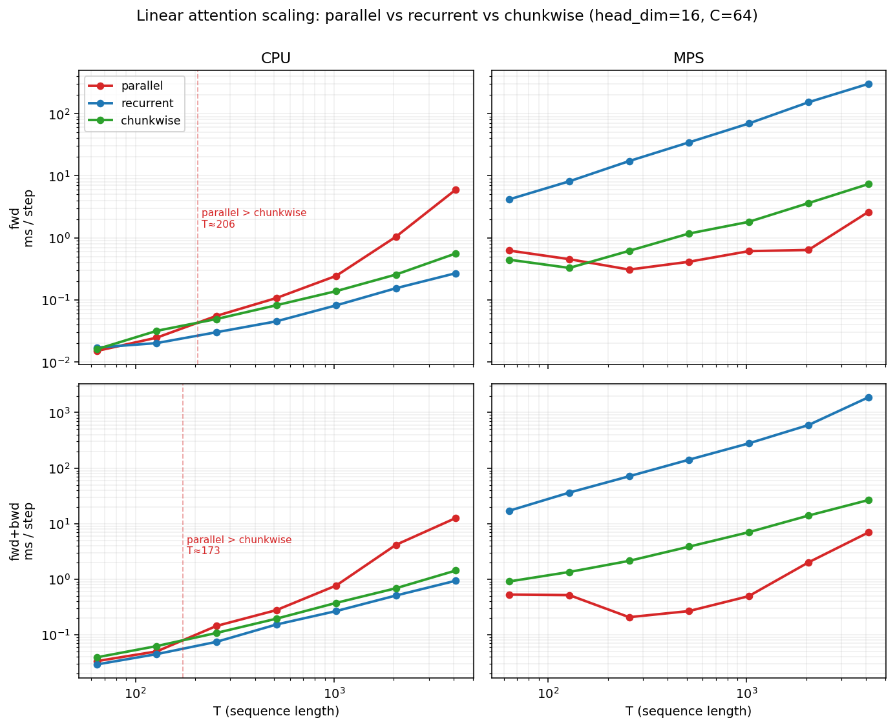
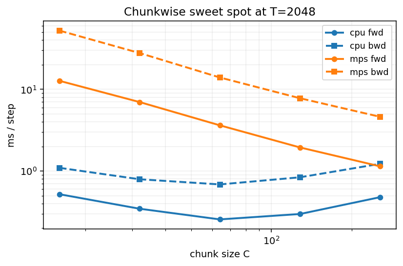
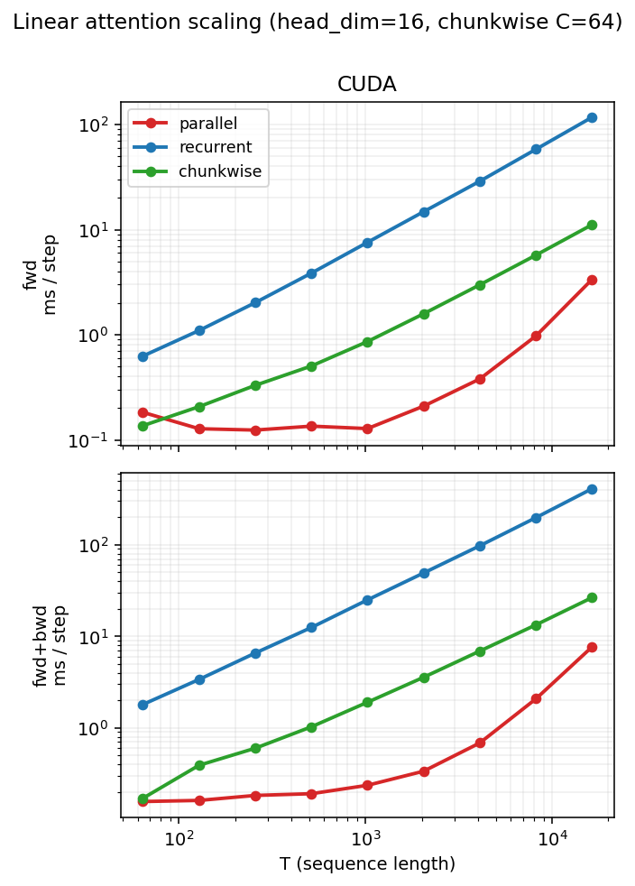
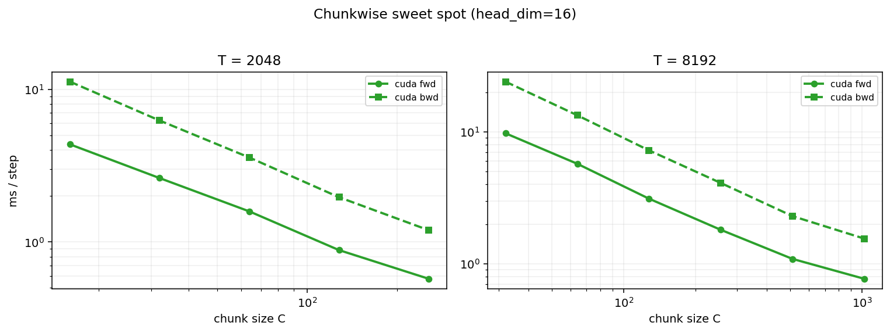

# Code scratchpad

Minimal implementations of softmax / linear attention / DeltaNet / Gated
DeltaNet on MQAR for the linear-attention post. One file per architecture;
the only line that changes is `self.attn = ...`.

## Two minimal experiments

Each isolates one axis. ~5 min each on CPU.

```
uv run python experiment_capacity.py
uv run python experiment_retention.py
```

Cells are cached by (config + source-file bytes) under `.experiment_cache/`.
Edit one model file → only its cells recompute. `--rerun` forces, `--parallel N`
dispatches N cells across worker processes. Pair with two terminals
(`OMP_NUM_THREADS=2 ... --parallel 4` each) for 8-way concurrency.

### Capacity ceiling — LinAttn vs DeltaNet

LA's additive `S += v k^T` saturates at `N_KV ~ d_k`. DN's delta rule
overwrites in the key direction and degrades past the ceiling rather than
collapsing.

vocab=256, T=128, dim=64, head_dim=16, lr=3e-3, n_train=20k. `N_KV ∈ {4, 32}`
brackets the ceiling.

| N_KV | model            | best_acc |
| ---: | ---------------- | -------: |
|    4 | Linear Attention |    0.966 |
|    4 | DeltaNet         |    0.994 |
|   32 | Linear Attention |    0.049 |
|   32 | DeltaNet         |    0.771 |

Below the ceiling: both solve. At 2×: LA collapses to ~1/N_KV (random
pick from the value set), DN holds at 0.77 — the JL soft-cap past `d_k`,
not a hard cliff.

### Streaming noise — DeltaNet vs Gated DeltaNet

Every non-write token still writes a rank-1 perturbation through `W_k`.
At fixed N_KV, this noise accumulates with T. Gating's `α < 1` decays it;
plain DN can't.

vocab=1024, N_KV=4 (well below the ceiling), dim=64, lr=3e-3, n_train=20k.
`T ∈ {64, 512}`. Gate parameterised Mamba2-style:
`α = exp(-softplus(dt_logit) · σ(x·W_α + b_α))` with `dt_logit` init −10
so α ≈ 1 at step 0 and stays in (0, 1].

|    T | model            | best_acc |
| ---: | ---------------- | -------: |
|   64 | DeltaNet         |    0.985 |
|   64 | Gated DeltaNet   |    0.984 |
|  512 | DeltaNet         |    0.909 |
|  512 | Gated DeltaNet   |    0.939 |

T=64: tied — no streaming noise to decay. T=512: GDN +0.03. The bounded
init keeps the gap small — `softplus` saturates at very negative input,
so `dt_logit` moves off −10 slowly. Less aggressive init (e.g. −3) would
trade `α ≈ 1` fidelity for faster activation.

### Scaling — parallel vs recurrent vs chunkwise

Three single-head impls of `S_t = S_{t-1} + k_t v_t^T` (no delta, no gating):
parallel `(Q K^T ⊙ M) V`, per-token `lax.scan`, and chunkwise (scan over
chunks of size C, parallel form within). fp32, head_dim=16, batch=1.

```
uv run python bench_chunkwise.py --device cpu
uv run python bench_chunkwise.py --device mps
uv run python bench_chunkwise.py --device mps --c-sweep
uv run python bench_chunkwise_plot.py
```

**MacBook Pro M5** (10-core, 16 GB)



CPU: XLA fuses the scan tightly, so recurrent stays fastest at every T;
parallel pays its T² tax past T≈200 and crosses chunkwise.
MPS: per-token scan is dispatch-bound and recurrent collapses to a flat
~1–15 ms ceiling; chunkwise wins everywhere, parallel climbs steeply.
That gap is the entire point of chunkwise.



Chunk size C trades intra-chunk parallel form (large C → T² waste inside
each chunk) against scan length (small C → dispatch overhead). At T=2048
the CPU sweet spot is ~C=64; on MPS the curve is still falling at C=256
— bigger chunks, and bigger feature maps, are where MPS wants to live.

**A100** (40 GB, single GPU)



Recurrent is hopelessly dispatch-bound (~50× slower than parallel at every
T), so the chunkwise vs parallel race is the interesting one.
Parallel stays flat at ~0.13 ms up to T≈2048 — the (T,T) attention matrix
fits in cache and the whole forward is just one launched kernel.
Past T=4096 it starts climbing, but at T=16384 parallel is still ~3× faster
than chunkwise at d=16 single-head. The crossover never materialises in
this config: even a 1 GB attention matrix is bandwidth-cheap when the d=16
matmuls amortise into a single fused launch.



Both T panels fall monotonically with C — no sweet spot. With d=16 every
intra-chunk matmul is tiny, so the only thing C buys is fewer scan
iterations. Real linear-attention models don't live here: head_dim=64–128
puts a meaningful d² carry update inside each chunk, and multi-head ×
batched workloads change the launch arithmetic. This config is small
enough that parallel keeps the lead — chunkwise's win is *structural*
(O(T·d²) compute, O(d²) state) and shows up clearly only in regimes
parallel can't enter.

CSV is gitignored, regenerate locally.

## Setup

```
uv sync                  # CPU only
uv sync --group cuda     # + NVIDIA GPU (Linux x86_64)
```

CPU is the JAX default. DN's per-token scan is dispatch-bound on
accelerators for tiny ops; CPU wins at this scale. Force GPU with
`JAX_PLATFORMS=cuda,cpu`.

## Run a single model

```
uv run python transformer.py
uv run python linear_attention.py
uv run python deltanet.py            # plain
uv run python deltanet.py --gated    # gated
```

Each trains on `level1` (vocab=8192, T=64, N_KV=4 — Zoology's easiest)
and prints predictions on a held-out example.

## Layout

- `data.py` — MQAR generator + `level1` Config.
- `train.py` — shared training loop.
- `utils.py` — RMSNorm, SwiGLU, RoPE.
- `transformer.py` / `linear_attention.py` / `deltanet.py` — one mixer each.
- `experiment_capacity.py` / `experiment_retention.py` — minimal sweeps.
- `cache.py` — content-addressed cell cache.

## Shape conventions

```
T  = sequence length
D  = model dim
H  = number of heads
Dh = head dim  (= D / H)
V  = vocab size
B  = batch size
```

## Sources

- [HazyResearch/zoology](https://github.com/HazyResearch/zoology)
- [Zoology paper (arXiv 2312.04927)](https://arxiv.org/html/2312.04927v1)
- [Zoology blogpost — Measuring and Improving Recall](https://hazyresearch.stanford.edu/blog/2023-12-11-zoology1-analysis)
